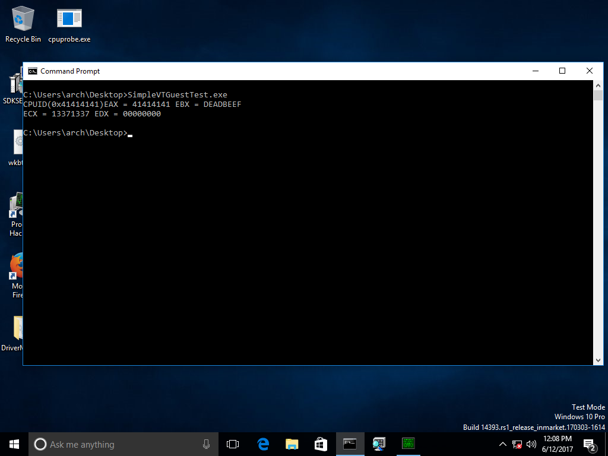

# Simple Hypervisor
-------------------
## Description
Simple Hypervisor to play with Intel VM Extensions.

## Test Environment
Tested on Windows 10 x64 14393.969 under VMWare Workstation Pro 12.5.6 build-5528349 

## TODO

* Add Dynamic VMXOFF Logic
* Add Exception hyperjacking Logic
* ...

## References

[https://github.com/ionescu007/SimpleVisor][1]
[Thread on KanXue][2]
[Intel 64 and IA-32 Architectures Software Developer Manuals][3]

[1]:https://github.com/ionescu007/SimpleVisor
[2]:http://bbs.pediy.com/thread-144656.htm
[3]:https://software.intel.com/en-us/articles/intel-sdm